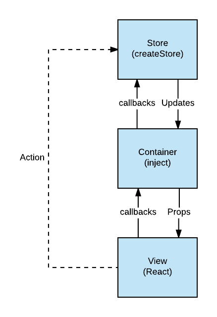

# Overview

# Catalog structure

How things are linked up

## Routes

We have a component based approach of defining routes, that is based on React Router v4:

```jsx
<BrowserRouter>
  <div>
    <Route path="/" component={App}>
      <Switch>
        <Route path="/about" component={About} />
        <Route path="/contact" component={Contact} />
      </Switch>
    </Route>
  </div>
</BrowserRouter>
```

In React Router v4, there is no centralized route configuration. Anywhere that you need to render content based on a route, you will just render a <Route> component.

# Styling

We use bootstrap for styling the overall page. We have a custom stylesheeet that we include after bootstrap css that overrides some of bootstraps styling pluss adds our own css classes and also our custom icons. In the beginning we used a package called react-bootstrap alot. Missing or bad experiences with boostrap made it difficult to see the whole picture and forms was nested into forms, and other bad nesting was done, due to missing knowledge about bootstrap. Because of this we started desiging components with pure JSX/HTML and added bootstrap class names to the elements. There is no need to use yet another react-XXX package when the time to code things manually is so much faster.

# Concepts

## Flux

A component triggers a callback when you click a button. This callback is mapped to the component from the container, which in turn maps this callback to a call on an action creator in a store that in turn calls .next(...) on a subject. This subject is merged into the store reducer which will emit a new version of the store. When the observable emits the new data, the container will re render the view.



## Modules

The modules directory is what we could call the "pages" directory. Each sub folder in the modules directory is by definition a page. Some of the sub folders in the modules directory contains other sub folders, which in turn is sub pages of the page in question. For ex analysis under modules has exchange as a sub folder, because exchange is a sub page under anaylsis. Each module/page (or sub folder) contains mostly the following parts:

- containers/smart-components that are linked to from routes.js
- components/views that are used by the above mentioned containers
- stores that are referenced by the above mentioned containers
- form definitions (that are in effect also stores) that are referenced by the above mentioned containers
- other helper files like local types, shared submit logic etc used by containers etc

As you see everything is tied together via the containers, that imports the stores and views, and wire them together.

## Containers

The concept of containers is like smart components. It is the glue between the routes and the views. It connects stores and forms, and the components/views, and ties everything together.

## Components

The components should be dumb components that only display data. However, we have view components that have a lot more logic that they need. But we desire simple, stateless and functional components above classes with "this.props". The life cycle methods should only be used in containers via the use of the lifeCycle hoc. HoC's is a short name for "Higher Order Components".

## Types (flow)

Flow is type system from facebook, which enables developers to typecheck their javascript files. Flow resembles the typescript syntax, in fact its almost identical. It has the same features as typescript except for one thing. Flow can differentiate between optional field and optional value, whereas typescript combines those two into one. In flow you can say `{ field?: ?string }` whereas in typescript you can only say `{ field? :string }` but they mean the exact same thing. By adding flow to your javascript files, you are actually prepared to migrate to typescript (mostly).

One thing to note about flow types is, never use any! Instead use existential type annoation (https://flow.org/en/docs/types/utilities/#toc-the-existential-type) or even better make a type for the parameter...

# Testing

## Jest

We use react-scripts, which is a build scripts package from facebook, that contains a setup for jest. Jest is facebooks test framework for react. To run tests affected by recent code changes run `npm test`, to run all tests run `npm test a`.

## Enzyme

We use enzyme which have great documentation on their website. We use another package called enzyme-to-json that is used in conjunction with the jest method toMatchSnapshot. But, I strongly suggest to NOT use toMatchSnapshot. Its buggy, you dont get any actual value from it and its just troublesome when you do a lot of work on the code base and gets a diff from jest telling you that the snapshot doesnt match.

Use enzyme for what is worth :)

# Generics

## React

React classes can be typed, if the file is annotated with flow, with their props and state types. Heck I think flow even will require you to type react classes. Functional components however is typed by the props argument to the stateless function.

## RxJs (react-rxjs)

Currently frontend is using a library called react-rxjs.

There are two versions of this package now.

1. The one currently used by frontend and situated at gitlab under the MUSIT-Norway user

- https://gitlab.com/MUSIT-Norway/react-rxjs

2. A version of react-rxsjs ported to typescript and published to npm

- https://github.com/jarlah/react-rxjs
- https://www.npmjs.com/package/react-rxjs

This latter version no longer has the RxProvider component. The RxProvider was a means of injecting store observables into react context which could then be automatically injected with the legacy RxInject hoc.

Porting frontend to use the npm published version is therefore to just import appSession and whatever other store is needed by the container, and create a new store based on the stores you need for the container.

Example:

store.js

```js
import { createStore } from 'react-rxjs'
import type { Reducer } from 'react-rxjs'
import { Observable } from 'rxjs'
import appSession$ from '../stores/appSession'
import type { AppSession } from '../types/appSession'

type CombinedStore = {
  appSession: ?AppSession,
  someOtherStore: ?...
}

const initialState: CombinedStore = {
  appSession: null,
  someOtherStore: null
}

const combined$: Observable<Reducer<CombinedStore>> = Observable.combineLatest(
  appSession$,
  someOtherStore$,
  (appSession, someOtherStore) => (state: CombinedStore) => ({ ...state, appSession, someOtherStore })
);

const combinedStore$ = createStore('combinedStore', combined$, initialState);

export const someAction = () => someSubject$.next();
export const someOtherAction = () => someOtherSubject$.next();
export default combinedStore$;
```

container.js

```js
import { inject } from "react-rxjs";
import { Observable } from "rxjs";
import ViewComponent from "./view";
import combinedStore$, { someAction, someOtherAction } from "./store";

const props = (storeProps: CombinedStore) => ({
  ...storeProps,
  someAction,
  someOtherAction
});

export default inject(combinedStore$, props)(ViewComponent);
```

Comprehensive (and working) example:
https://gitlab.com/MUSIT-Norway/react-rxjs-example

# JavaScript and related frameworks & libraries

**Documentation**

- [React](https://facebook.github.io/react/), rendering lib
- [RxJs](https://facebook.github.io/flux/docs/overview.html), reactive stream lib
- [Bootstrap](https://getbootstrap.com/docs/3.3/), CSS styling
- [NodeJs](https://nodejs.org/en/docs/), js vm
- [npm](https://docs.npmjs.com), package manager
- [flow](https://flow.org/en/docs/), typing javascript
- [Prettier](https://github.com/prettier/prettier), code formatter
- [Jest](https://facebook.github.io/jest/) test runner
- [Enzyme](http://airbnb.io/enzyme/), test asserts on react components
- [Flux](https://facebook.github.io/flux/docs/overview.html)
