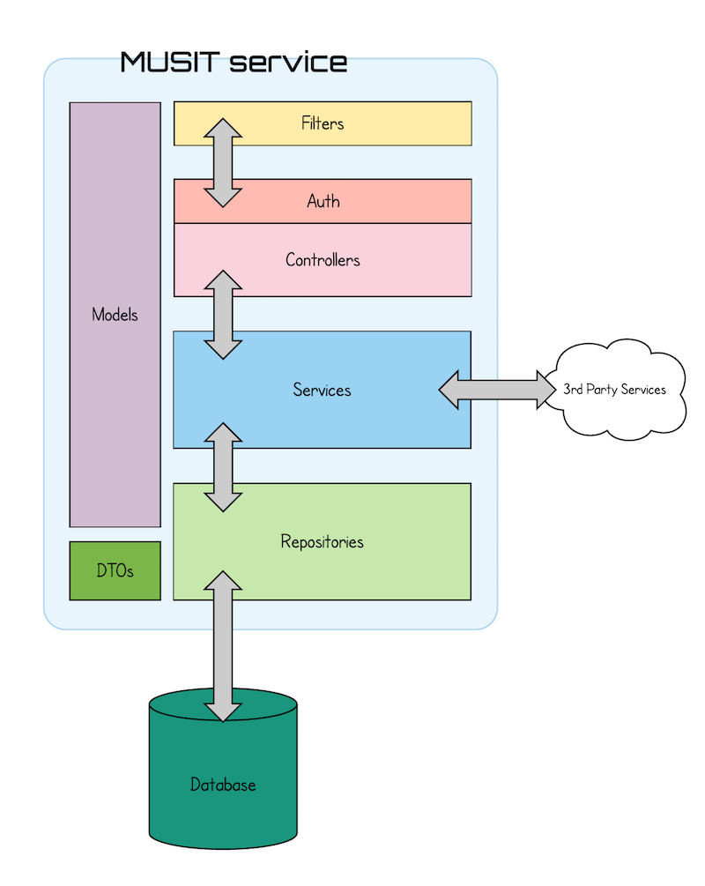
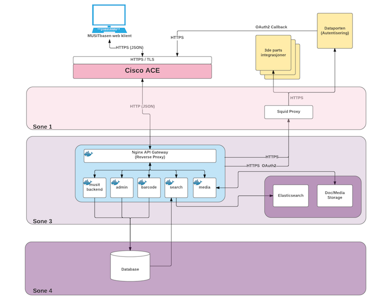

# MUSIT Backend Architecture

The MUSIT backend is where the core logic of the system as a whole can be found. It consists of several moving parts that in combination should provide all the required functionality and constraints. The main service application is called `service-backend` and should be considered a monoloith. Meaning, it spans most of the bounded contexts for the entire system. With a couple of exceptions.

The choice of a monolithic architecture greatly simplifies the initial implementation. But it also demands a lot of **discipline** from the developers. It's very tempting to "just use the repository from that other package", instead of respecting the packaging/module boundries. Being true to the boundries will ensure that the codebase is much easier to reason about. And that a refactoring to extract some functionality into microservices is much more feasable.

## Architecture of a service

All service applications (individually running applications exposing some API), are implemented using the [Play! Framework](https://playframework.com). The internals of these follow a traditional tiered architectural approach. Below is a simple diagram showing how such a service is typically built up.

### Filters

The outer-most layer in a service are the `filter`s. They intercept all requests and responses going in and out of the service. In the MUSIT system there are, at the time of writing, there are 2 filters defined. These must be enabled on all service applications:

* `no.uio.musit.service.NoCacheFilter`: Ensures that all responses are provided with a header instructing the upstream consumers of services not to cache the content it receives.

* `no.uio.musit.service.AccessLogFilter`: Measures the time it takes for a request to be processed. Then, just before the response is returned to the caller, a log line is written to the service access log.

### Models

All MUSIT service applications contain a **package** called `models`. This is illustreated by the vertical box spanning across all the different layers in the diagram. The `models` package is grouped into sub-packages reflecting the different domains the service application operates on. In each of the domain specific packages you will find the data models that reflect that domain.

### Auth

Authentication and initial authorization is handled specifically before a request enteres a specific controller method. Which auth requirements apply for different **service endpoints** must be carefully evaluated and applied to each method. The auth layer is enabled by ensuring the controller classes extend the `MusitController` trait.

### Controllers

Controllers for different domains / bounded contexts are grouped together in the same package. The controller layer is where the service endpoints are defined. Each endpoint maps 1:1 to a method defined in a controller. The JSON contract (request/response) are typically based on the data types defined for the given domain found in `models`.

### Services

When the requests have entered a _service endpoint_ method in the controller, the request is typically parsed and passed down to the `service` layer. It is in **this** layer all business logic should be placed. All services should be isolated in a package reflecting the domain they apply to. Business logic should never "leak" above or below the scope of this layer. In some cases there is behaviour related to certain `types` in the data model. As long as this can be isolated into a pure function (no side-effects like IO etc), it can be implemented as part of the `class` definition or its companion object. Under no circumstance must functionality requiring IO be implemented elsewhere than the service layer.

#### 3rd Party Services

Some services require integration with 3rd. party service providers / API's. These are strictly IO bound and _must_ be placed in the service layer. Preferrably in some `<3rd party name>Connector` implementation.

### Repositories

The bottom layer of a service application is the `repository` layer. This is where all integrations with data persistence technologies can be found. Typically, for MUSIT, this involves a relational database. But it can be anything from accessing the filesystem to NoSQL databases. The layer is grouped with the same per domain package structure as all the other layers.

Ideally, a repository implementation would extend an interface (or `trait` in Scala) that describe the contract the implementation must adhere to. However, since the MUSIT application is unlikely to move to a database other than a relational database, the repositories are directly implemented as DAO's (Data Access Objects). 

## Target Architecture

### Zone 1

Sone \#1 is an insecure zone that can make/receive calls directly to/from the outside world. No components from the MUSIT application should run in this zone.

#### Squid proxy

For the MUSIT application to be able to call outside the USIT network, it relies on a proxy. For this purpose a [squid](http://www.squid-cache.org) proxy is installed to let requests to a pre-configured set of domains pass through.

**¡¡¡ IMPORTANT !!!** If there is a need to call any 3rd party service outside USIT that isn't already configured in squid, it must be added specifically by the USIT system administrators.

### Zone 3

This is a secure zone that cannot reach the outside world unless the requests are passed through a proxy. All the MUSIT application components run servers that can be found here.

#### Docker and services

All MUSIT service applications (including a Nginx proxy) runs inside docker containers.

#### ElasticSearch and other on-disk storage

For searching through the data, we are using ElasticSearch as a search engine. It has some specific HW requirements to run in an efficient way. Therefore we are _not_ running ElasticSearch in a docker container. It is installed directly on a separate server so that it has access to the sufficient amount of RAM, CPU and disk space.

Another disk bound part of the MUSIT system is the "document module". It requires access to a (large) disk to be able to persist uploaded files. Ideally this is a fast network SSD disk that can be mountet into the docker container running the `service_document` module.

### Zone 4

As zone 3, this is a secure zone that cannot be reached from the internet. It's got some more security meassures to ensure that no unauthorized network access occurs.

#### Database

The new MUSIT databases are running in zone 4. This is to ensure the proper level of protection for the data. It is especially important since the MUSIT application keeps some data that is considered sensitive. Moving the database to a less secure zone, or easing up on the restrictions on how the they can be accessed **must** be cleared with both the security manager and legal departments at UiO.