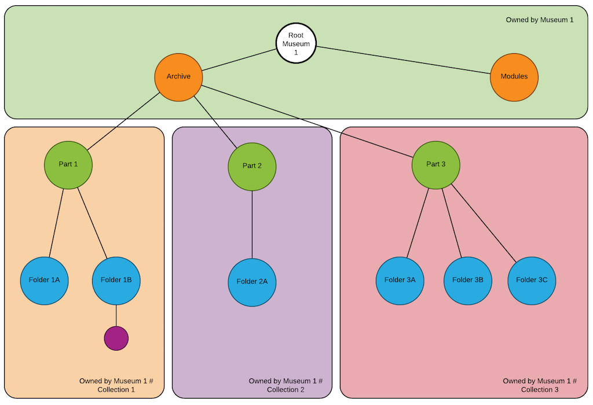
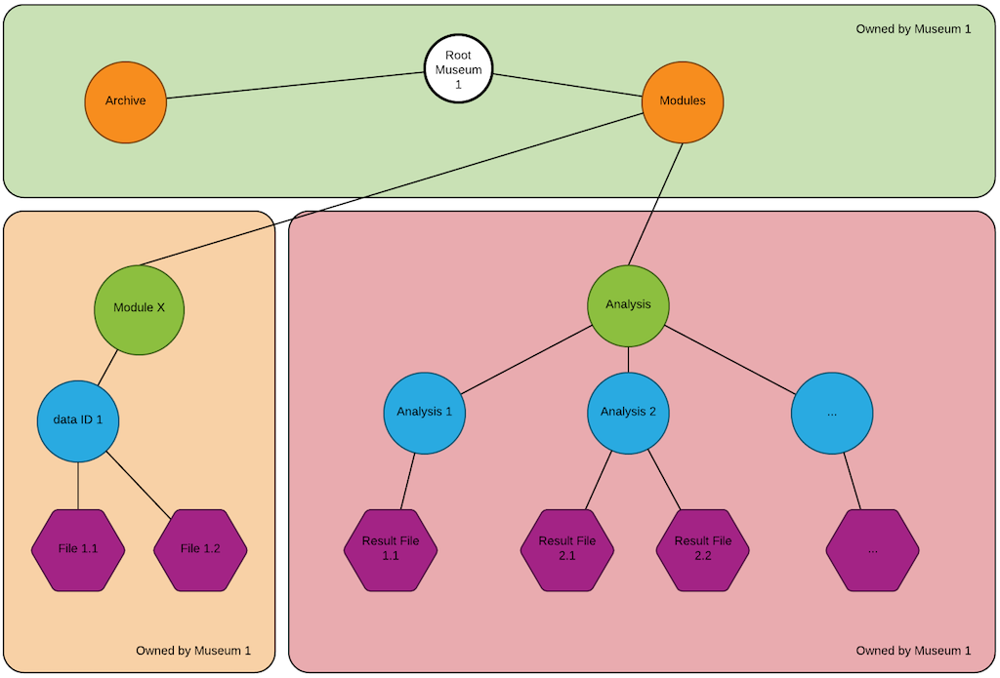

# Document Module

## The Document Archive

A document archive is built up using a virtual file system. The underlying
virtual file system is built up using 2 basic building blocks, **folders**
and **files**.

In the context of MUSIT, there are further abstractions on top of folder to
model different _types_ of folders. These allow the virtual file system (tree)
to enforce certain rules for how the archive is built up.

### Archive data types

There are several different abstractions for the folder concept. Below is
a list of the (currently) know types:

**Folders**

* `Archive`: The top-level folder of a museum archive. 
* `ArchivePart`: Represents sub-archives under the `Archive` node.
* `ArchiveFolder`: Archive specific folder type to organise content below an`ArchivePart`.
* `GenericFolder`: A general purpose folder that is _only_ to be used for building folder trees _outside_ the scope of an `Archive` folder.

**Documents/Files**
* `ArchiveDocument`: Represents a file that is uploaded to the system.

In addition, the following couple of folder types might become necessary:

* `DocumentPost` (dokumentpost)
* `CaseFolder` (saksmappe)

### Archive tree



The above figure illustrates how the archive folder structure is built up. At the very top of the tree, there will always be a `root` folder. There's 1 `root` per `Museum` in the system. The `owner` of the tree is set to be the same as the int value of the `MuseumId` associated with each `Museum`.

The `Archive` folder represents the top-level folder in the document **archive** system. This is the point from which the `document archive` _module_ will be built.

#### Rules

When building an archive structure the following rules must be enforced:

1. The top node is called `ArchiveRoot` and maps 1:1 with the underlying `Path.root`.
2. There can only be 1 `Archive` folder per museum/institution under the root.
3. An `Archive` folder can contain `0 -> n` exclusively of type `ArchivePart`.
4. An `ArchivePart` can contain `0 -> n` items of type `ArchiveFolder` and `ArchiveDocument`.
5. An `ArchiveFolder` can contain `0 -> n` items of type `ArchiveFolder` and `ArchiveDocument`. In effect making the possible depth of the archive hierarchy infinitely deep.

### MUSIT Modules



Different modules in the MUSIT system have different needs with regards to file
uploads. That be uploading reports associated with a storage facility `Control`, or an attachment to an `AnalysisResult` in the analysis module, etc. To accommodate these different needs, we need to build a "hidden" folder structure that isn't part of the main `Archive` tree. This section will describe how this "hidden" folder structure should work.

The `ArchveRoot` folder is the **true** root for a museum. And we can easily add to the direct children from the root and build a folder-tree that is parallel to the `Archive` tree.

1. To allow uploading files in different modules, we've created a `GenericFolder` called `Modules`.
2. Below the `Modules` directory, we add another set of `GenericFolder`s that represent each module. E.g. `Analysis`, `StorageFacility`, `Loan`, `Conservation`, etc.
3. Below each module specific directory, we create new `GenericFolder`s for each data type ID. For `Analysis` the child folders will be given the name of the `EventId` (which is an int/long value). For a different module it could be a different kind of identifier like a `UUID`. This extra "layer" of folders ensures it's possible to upload files with the same name to different types of data.

## Peristence

The document module / service relies on an underying library called [symbiotic](https://gitlab.com/kpmeen/symbiotic) for its document management needs. It is a modular library that supports a few different forms of data peristence.

The symbiotic specific configuration used for `service_document` can be found in the `service_document/conf/symbiotic.conf` file.

### Metadata

For the document module we are using the `symbiotic-postgres` as the DB where all metadata for files and folders are stored. There are no physical files written to the database.

### Files

The `symbiotic-postgres` library has a dependency to another library, called `symbiotic-fs`. This is used to persist the physical files to a configurable folder on disk. The default folder is called `dman/files`.

Below this folder the folder structure is built up by folders with names in the following form `YYYY-MM-DD`. All files uploaded any given day will be found in a folder with the date of that day.

The uploaded files are named after their `fid` (FileId) and `version` attributes. The naming scheme follows the form `<file uuid>.<version>`. A typicall name would be something like `6be96d38-9c05-428b-94ba-6b4da97c8bd3.1`. The next version of the file would get `6be96d38-9c05-428b-94ba-6b4da97c8bd3.2`, and so on.

No reference to the actual disk location is kept in the database. The system will _always_ use the file metadata to calculate the location on disk.

## Local Development

The `service_document` module requires a slightly different setup to run a fully functioning set of tests. Since the underlying `symbiotic` library uses a few postgres specific features, it is not feasable to use a H2 database for tests. Instead, it requires that a `postgres` database is running.

#### Starting a local postgres database

In the `service_document` project folder, there is a shell script called `docker-postgres.sh`. It's a convenient way to start a docker postgres container that can be used when developing and executing tests for the module.

**Usage**
```
./docker-postgres.sh [start|stop|clean|reset]
```

#### Testing

Testing the document module requires that a slightly different command is issued in SBT:

```
sbt allTests:test
```

The above command ensures that all tests that are `taggedAs PG` (or `taggedAs no.uio.musit.test.PostgresContainer`) are include as part of the test execution. For these tests to succeed, it is required to have a postgres DB running. If one isn't available, all the PG tagged tests will fail.

If running the normal `sbt test` command, the `taggedAs` tests **are ignored**.

The GitLab CI _always_ executes the `sbt allTests:test` command.